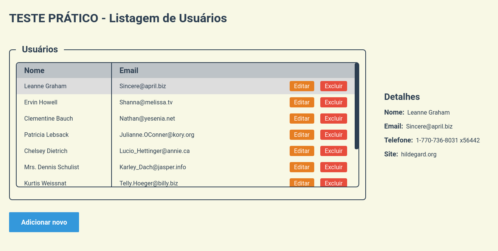

# Teste Prático - Listagem de Usuários

<br />
<p align="center">
  <a href="#objetivo">Objetivo</a>&nbsp;&nbsp;&nbsp;|&nbsp;&nbsp;&nbsp;
  <a href="#tecnologias">Tecnologias</a>&nbsp;&nbsp;&nbsp;|&nbsp;&nbsp;&nbsp;
  <a href="#como-usar">Como Usar</a>
</p>

## Objetivo

<div align="center">
  
</div>

O objetivo do teste foi criar uma aplicação básica com componentes de listagem e manutenção de usuários, como bônus criei também a função de editar um usuário para que se tornasse um CRUD completo, utilizando a JsonPlaceholder API para fazer as requisições HTTP, foi utilizado o redux para controle de estado da lista de usuários onde foram criadas actions e reducers para cada tipo de ação do usuário.

## Tecnologias

- [TypeScript](https://www.typescriptlang.org/)
- [ReactJS](http://reactjs.org/)
- [React Icons](https://react-icons.github.io/react-icons/)
- [Redux](https://redux.js.org/)
- [React Redux](https://react-redux.js.org/)
- [Axios](https://github.com/axios/axios)
- [Sass](https://sass-lang.com/)
- [Yarn](https://yarnpkg.com/)

## Como usar

### Clonando o Repositório

Para baixar o projeto na sua máquina, rode o comando abaixo no terminal ou faça o [download](https://github.com/gustavojuneo/learno/archive/main.zip).

```bash
$ git clone https://github.com/gustavojuneo/test-pratico-front/.git
$ cd test-pratico-front
$ cd users-list
```

### Instalando as dependências

Para começar a utilizar a aplicação, é necessário a instalação das dependências, para isso, utilize o comando abaixo para fazer a instalação:

```bash
$ npm install
```

ou

Caso você utilize o yarn, pode utilizar o comando abaixo para instalar as dependências:

```bash
$ yarn install
```

### Iniciando a aplicação

Para iniciar a aplicação use o comando:

```bash
$ npm start
```

ou caso utilize o yarn pode utilizar o seguinte comando:

```bash
$ yarn start
```

A aplicação irá rodar por padrão na porta 3000, você consegue acessar utilizando:
https://localhost:3000
